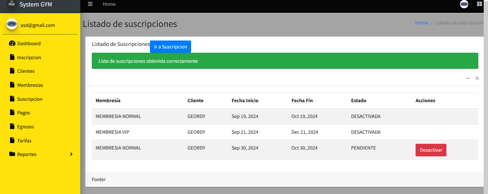

## Actualizar imagen de perfil

Para poder actualizar la imagen de tu perfil, deberas estar logueado en el sistema, no importa la ventana en la que estes, lo importante es que estes viendo la barra de navegacion izquierda

Si puedes viusalizar esta barra de navegacion entonces, deberas darle click a la parte donde aparece tu foto y el correo con el que te registraste

Una vez hayas hecho click en ese apartado, te rediriga a la vista de tu perfil, en este momento solo se puede cambiar la imagen de perfil, te debe aparecer algo similar

Deberas darle click al boton de "Examinar", este boton te abrira el explorador de archivos de tu computador, luego escoges la imagen que quieres poner de perfil, de preferencia se admiten los formatos "jpg/png" usar un formato contrario a este podria provocar fallas en la calidad o visualizacion de la imagen

Una vez seleccionada la imagen le deberas dar click al boton que dice "Actualizar imagen"

Si todo sale bien en la actualizacion de la imagen deberas ver un mensaje de exito como este

Para poder ver la nueva imagen, deberas cerrar la sesion y volver a entrar, para ver la nueva imagen

