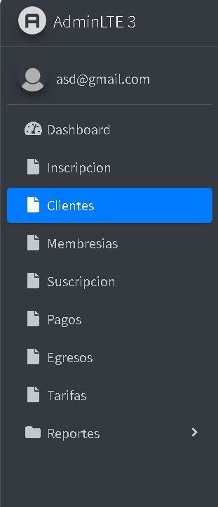
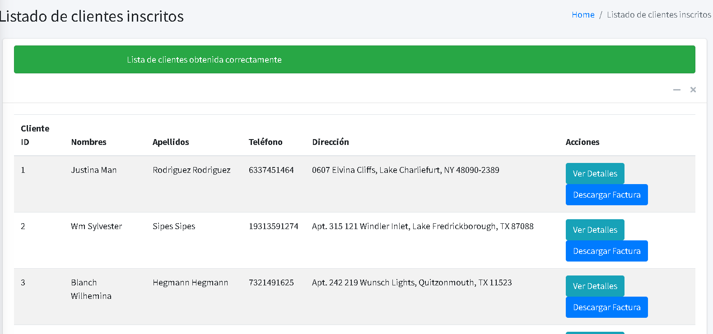
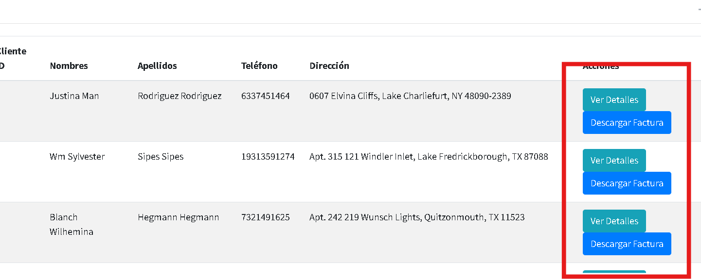

# Clientes
## Instrucciones Modulo Clientes.

Acceder al listado de clientes.

1.
Dentro del módulo de clientes, haz clic en el botón **"Clientes"**.

2.
Al ingresar al módulo de clientes, se visualiza el listado de clientes inscritos en el sistema.

3.
En la parte derecha, debajo del listado de **Acciones**, se encuentran dos botones donde se pueden verificar los detalles del cliente y descargar las facturas de un cliente en específico.

