# Módulo de Inscripción

## Instrucciones para Generar Inscripcíon.

Al entrar en el módulo de inscripción, podrás iniciar el proceso de inscripción de los clientes del sistema.

## Proceso de Inscripción de Clientes

### 1. Abrir Formulario de Inscripción
Dentro del módulo de inscripción de clientes, haz clic en el botón **"Inscripción"**.

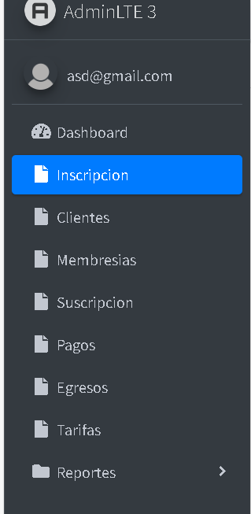

### 2. Completar Información del Cliente
- **Nombres**: Introduce los nombres completos del cliente.

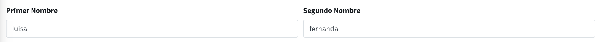

- **Apellidos**: Introduce los apellidos completos del cliente.

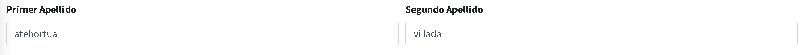

- **Fecha de Nacimiento**: Introduce la fecha de nacimiento.

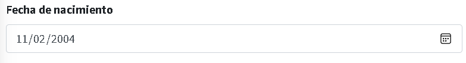

- **Dirección de Residencia**: Introduce la dirección de residencia.

- **Teléfono Personal**: Introduce un número de teléfono válido donde se pueda contactar al cliente.

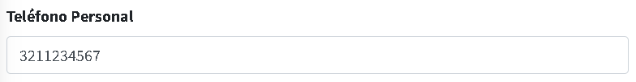

- **Teléfono de Contacto de Emergencia**: Introduce un número de teléfono válido donde se pueda contactar algún familiar o contacto adicional, en caso de emergencia.

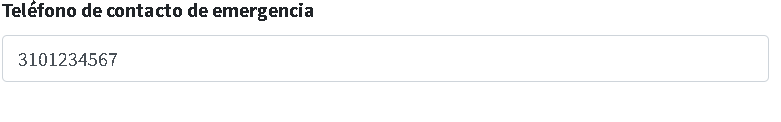

- **Correo electronico**: Introduce la direccion de correo electronico.

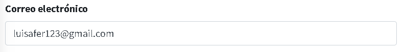

### 3. Información Médica
- **Lesiones**: Introduce si el cliente tiene algún tipo de lesión.

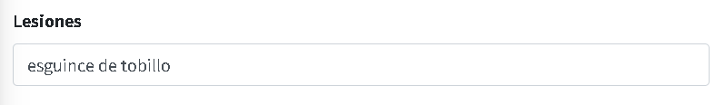

- **Enfermedades**: Introduce si el cliente tiene algún tipo de enfermedad o condición física.

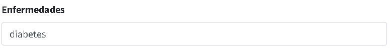

- **Información Médica Relevante**: Introduce un registro de datos relevantes sobre la salud pasada del cliente.

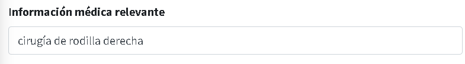

- **Tipo de Sangre**: Selecciona qué tipo de sangre es el cliente.

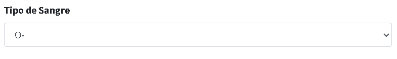

### 4. Información Adicional
Aceptar las políticas, condiciones y normas, que manifiesta el gimnasio.

### 5. Dar en el botón de Inscribir
Imprimir la factura de la inscripción que genera el sistema.

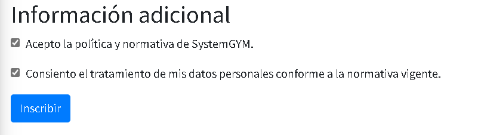

# **Oops lo sentimos usted no puede ser inscripto por fea**

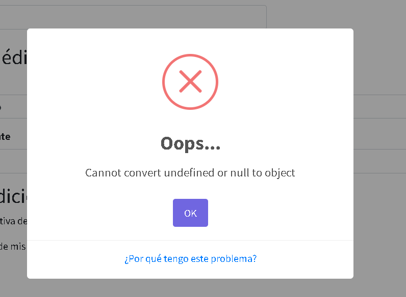