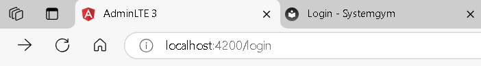
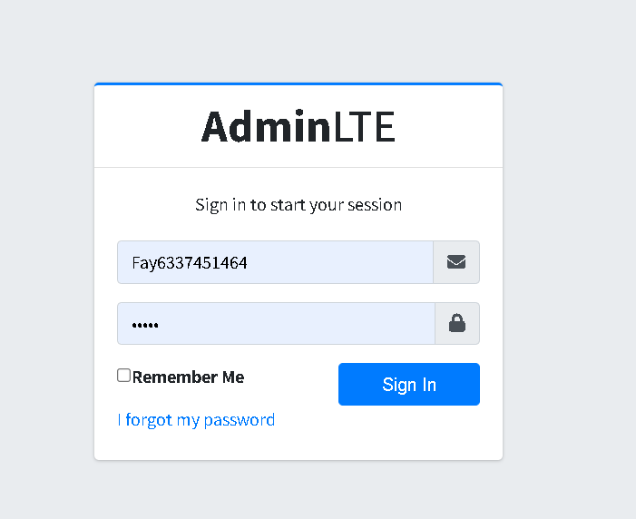
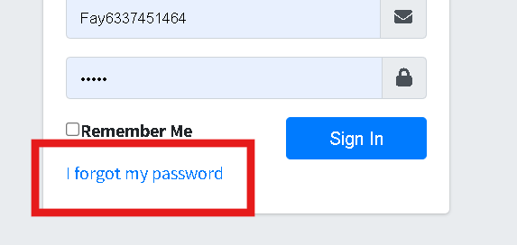
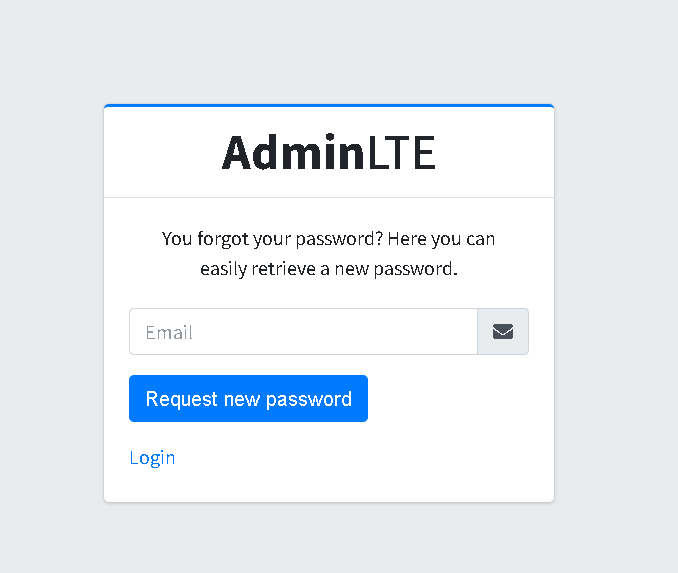

# Login

## Instrucciones para Ingresar LOGIN

1.
**Ingreso**: En su navegador de preferencia, ingrese la dirección URL que le fue asignada por el administrador del sistema. En este caso, para fines demostrativos, se utilizará la URL `localhost:4200/login`. Esta lo dirigirá a la página principal de ingreso al sistema.

2.
**Iniciar sesión**: Para ingresar al sistema deberá ser un usuario con el rol de **Administrador**. Este rol y la credencial deberán ser asignados por un administrador del sistema. Con la credencial de correo y contraseña, puede ingresar al sistema. Introduzca el correo en el campo **Email** y la contraseña en el campo **Password**, y luego haga clic en el botón **Sign in**.

## Esto nos direcciona directamente a la Dashboard

3.
**Olvidé la contraseña**: En caso de haber olvidado la contraseña, haga clic en la casilla que dice **I forgot my password**. 

4.
**Recuperar contraseña** Será dirigido a otra página donde se le solicitará ingresar su correo electrónico. Ingrese el correo y haga clic en el botón **Request new password**.

___
   El sistema enviará un correo electrónico al correo designado, permitiéndole recuperar la cuenta y cambiar la contraseña.
