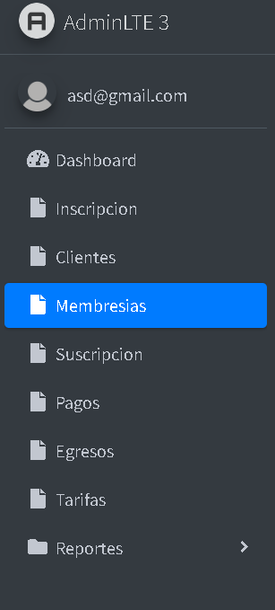
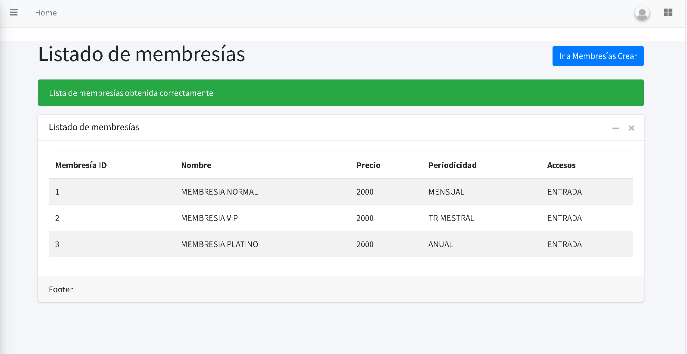
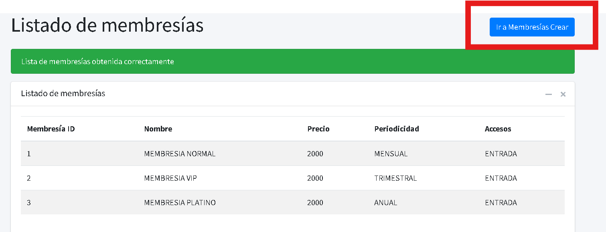
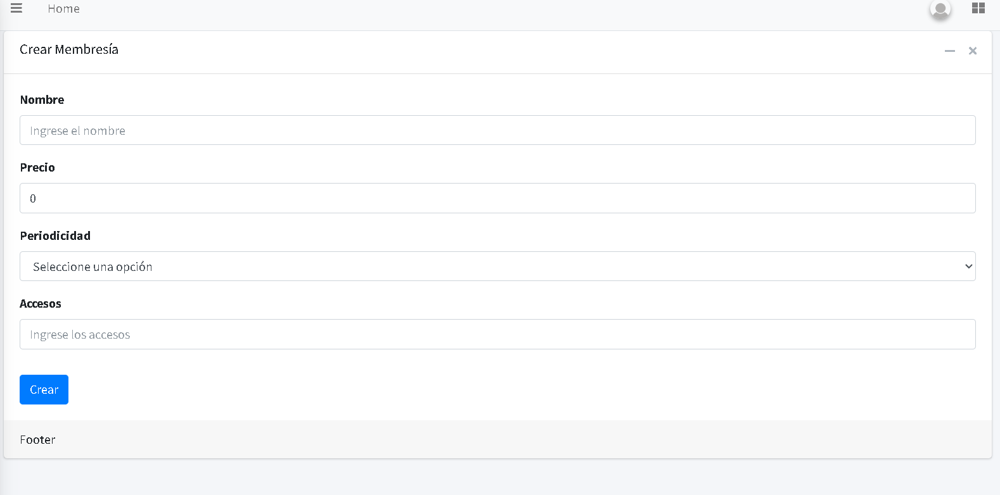
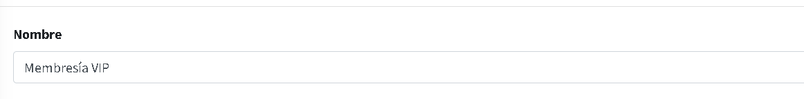
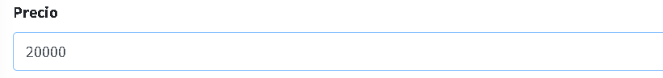
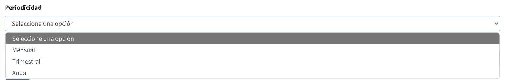
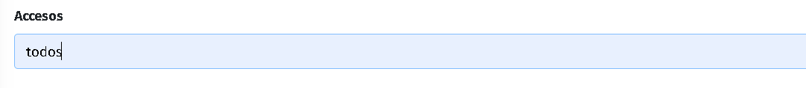
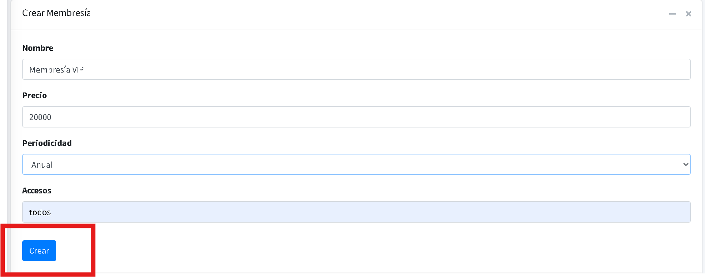
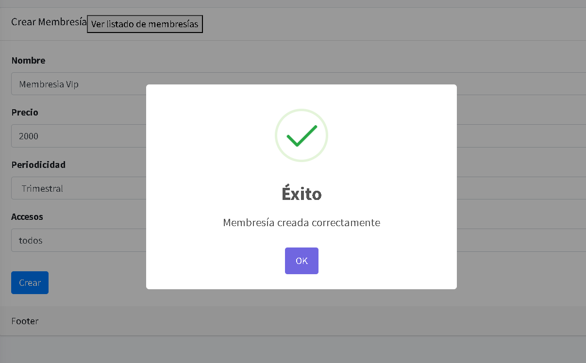

# Membresías

## Instrucciones para Generar una Membresía.

Al entrar en el módulo de membresías, podrás visualizar el listado de membresías.

1.
Ingresa al módulo de membresías, dando clic en el botón **"Membresías"**.

2.
Se visualiza el listado de membresías.

  

   En este listado podemos ver:

   - **El número de membresías actuales.**
   - **El tipo de membresía.**
   - **El valor.**
   - **El periodo (Mensual, Trimensual o Anual).**
   - **El acceso que ofrece cada membresía.**

3.
En la parte superior derecha, encontrarás un botón que dice **"Ir a Membresía Crear"**.

## **Crear una Membresía**

4.
Al hacer clic en **"Ir a Membresías Crear"**, se abrirá un formulario para crear una nueva membresía.

   - **Nombre**: Introduce el nombre de la membresía, ejemplo: Membresía VIP, PLATINO o NORMAL.

   

   - **Precio**: Introduce el valor designado para cada tipo de membresía.

   

   - **Periodicidad**: Introduce el periodo establecido para cada tipo de membresía (Mensual, Trimensual, Anual).

   

   - **Accesos**: Indica qué tipo de acceso posee el cliente.

   

5.
Haz clic en el botón **"Crear"** para finalizar el proceso.

6.
Finalmente, aparecerá un mensaje de **"ÉXITO, Membresía creada correctamente"**.

