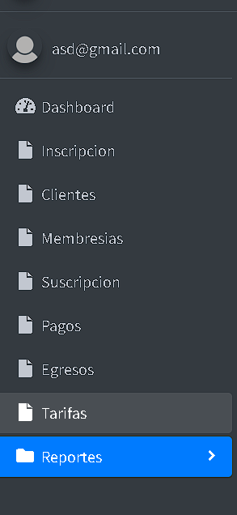
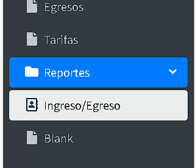
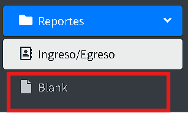
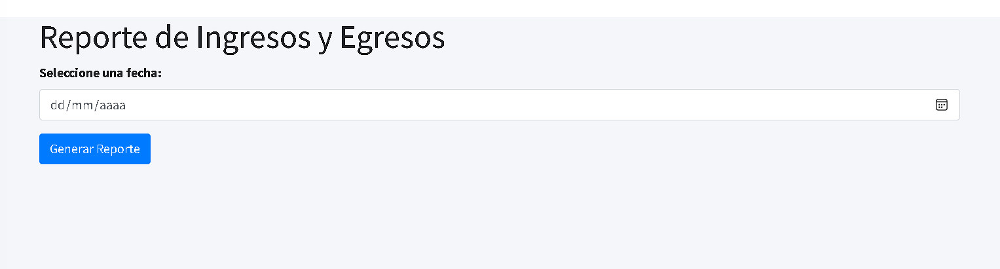
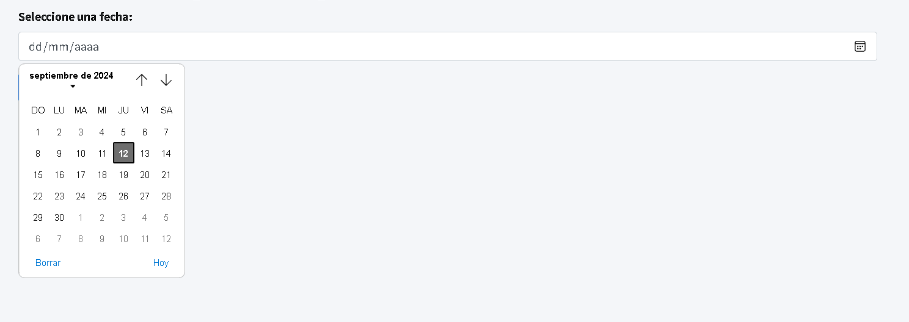
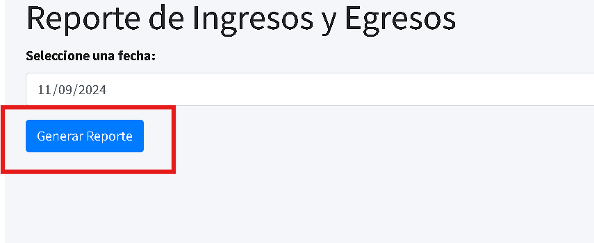
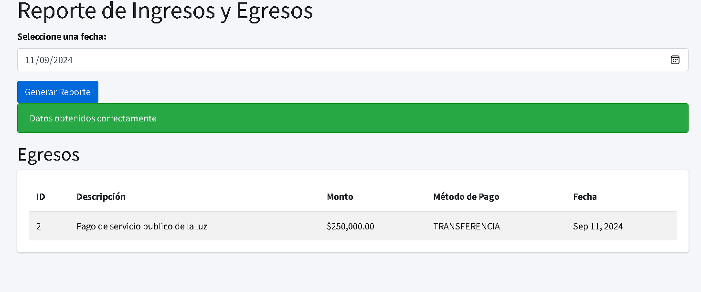

## Instrucciones para Generar Reportes

1.
Para acceder al módulo de reportes, haz clic en el botón **"Reportes"**.

2.
 Se abrirá una bandeja que mostrará los reportes de **"Ingreso/Egreso"** y **"blank**.

3.
Si seleccionas la opción **"Blank"**, regresarás al **"Dashboard"**.

4.
Al ingresar a la sección de **"Ingreso/Egreso"**, podrás revisar los reportes disponibles.

5.
Haz clic en la casilla **"Seleccione una fecha:"** e ingresa la fecha de la cual deseas obtener información.

6.
Finalmente, haz clic en el botón **"Generar Reporte"**.

7.
Aparecerá un mensaje que indicará **"Datos obtenidos correctamente"**, y podrás visualizar la información solicitada.

