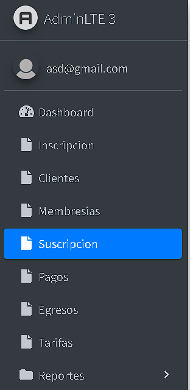
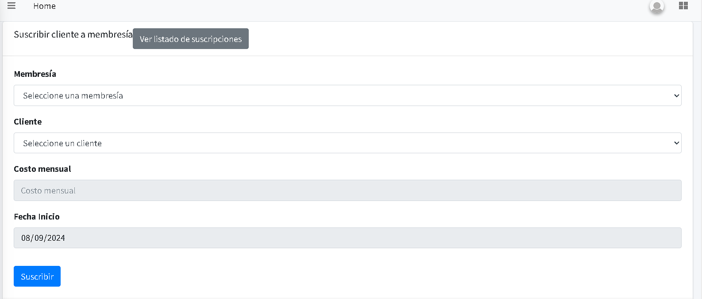
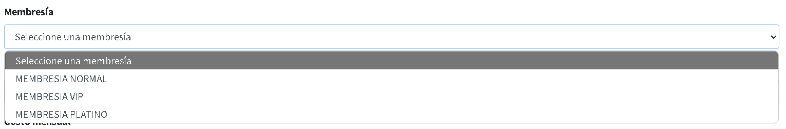
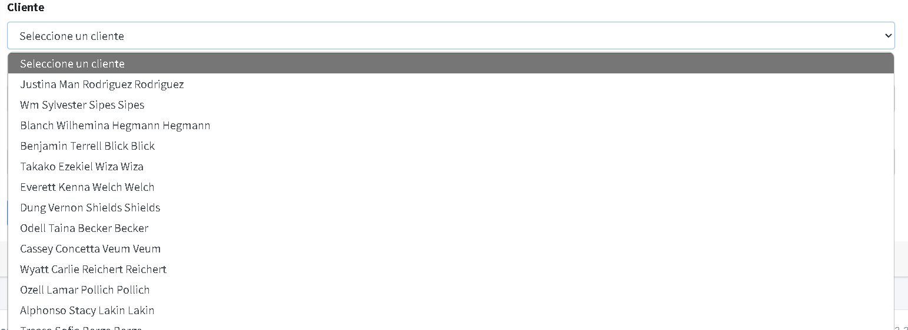
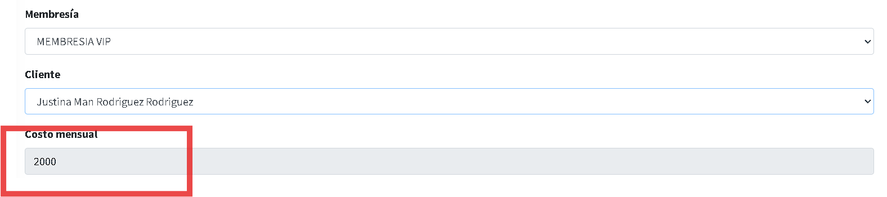
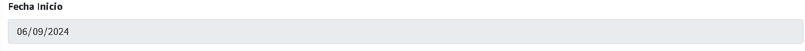
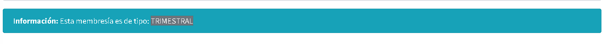
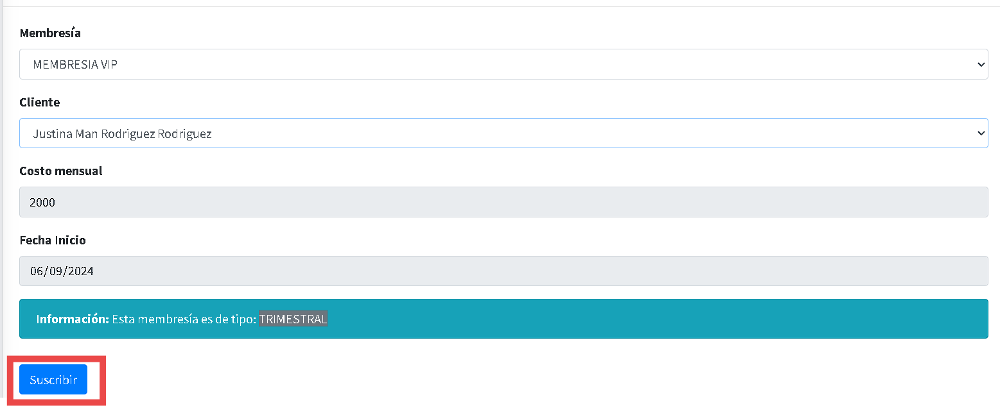
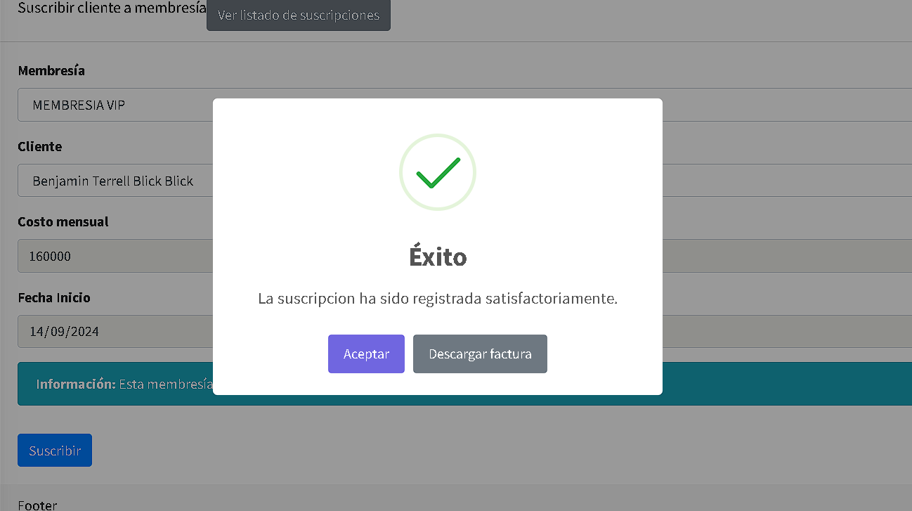
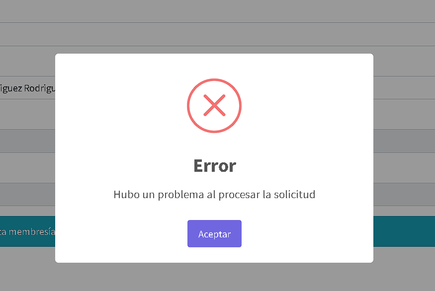

# Suscripción

## Instrucciones para Generar Suscripciones.

En el módulo de Suscripción, podemos observar el listado de clientes que están suscritos y nos permite agregar suscripciones a los clientes nuevos y antiguos.

1.
Ingresa al módulo de Suscripción, dando clic en el botón **“Suscripción”**.

2.
En este módulo podemos suscribir clientes a membresías y observar el listado de suscripciones.

## Acceder al Listado de Suscripciones

3.
En la parte superior del módulo de suscripciones, podemos encontrar el botón **“Lista de Suscripciones”**.

4.
Esto te redirigirá a una lista donde podrás ver todas las suscripciones registradas en el sistema.

## **Crear una nueva suscripción**

En caso de necesitar crear una suscripción nueva, debes seguir los siguientes pasos:

- **Membresía**: En la casilla que dice **“Seleccionar una membresía”**, escogemos alguna de las membresías de preferencia o la que vamos a utilizar, por ejemplo, **Membresía Normal**, **Membresía VIP**, etc.

- **Clientes**: Podemos escoger cualquier cliente que esté ingresado en la base de datos, por ejemplo, **Pepito Pérez**.

- **Costo Mensual**: Dependiendo del tipo de membresía que elijas, nos mostrará el valor a pagar.

- **Fecha Inicio**: Ingresamos la fecha en que se inicia la suscripción, con el formato de **dd/mm/aa**.

- **Nota de Información**: En esta nota podemos observar la información generada por el sistema, donde nos recuerda el periodo de tiempo que tiene cada membresía.

5.
Por último, para terminar con la suscripción, damos clic en el botón **“Suscribir”**.

6.
Nos mostrará un letrero informando si la suscripción fue **Exitosa**.

7.
En caso de que la suscripción no sea exitosa, nos mostrará un letrero informando que hubo un error: **“Hubo un problema al procesar la solicitud”**.

