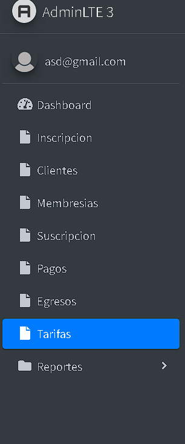
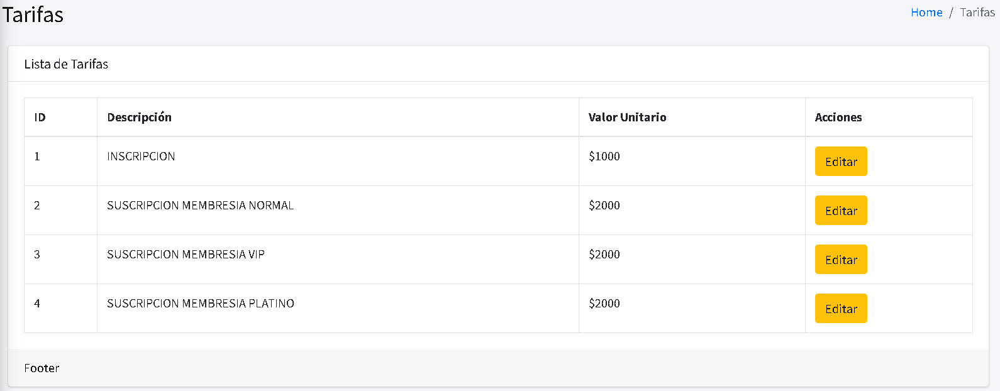
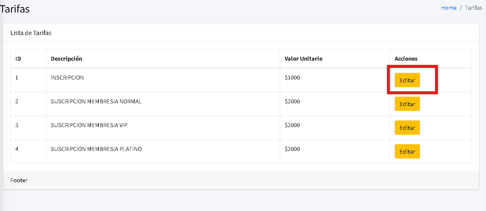
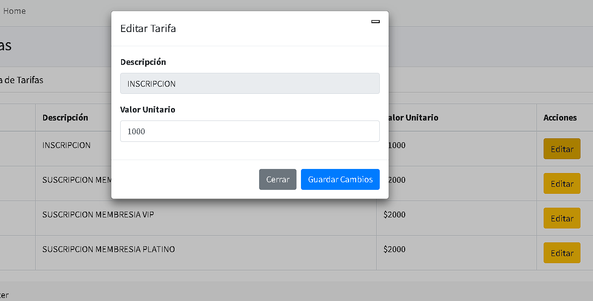
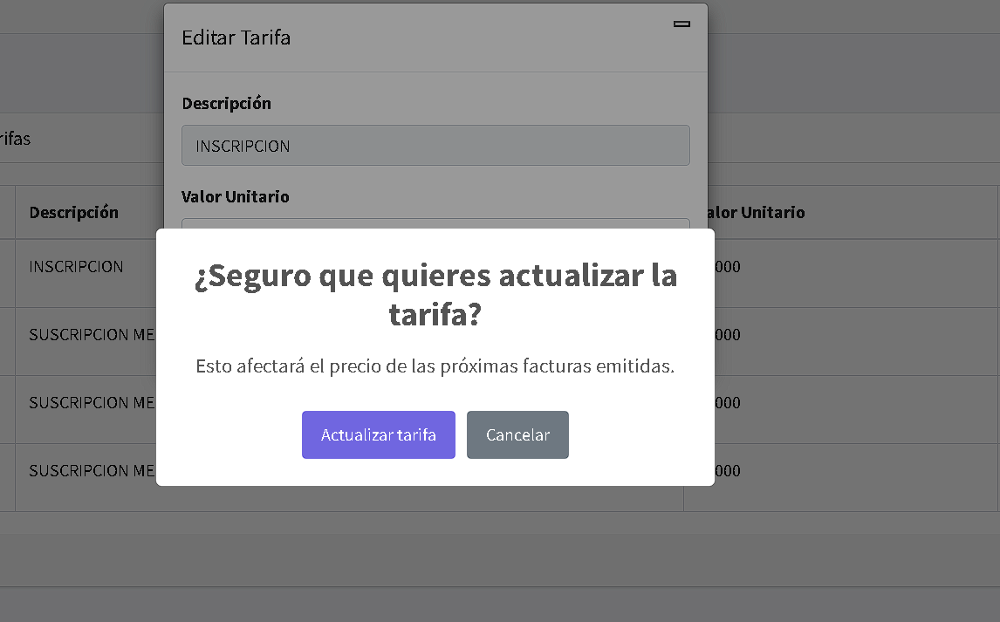
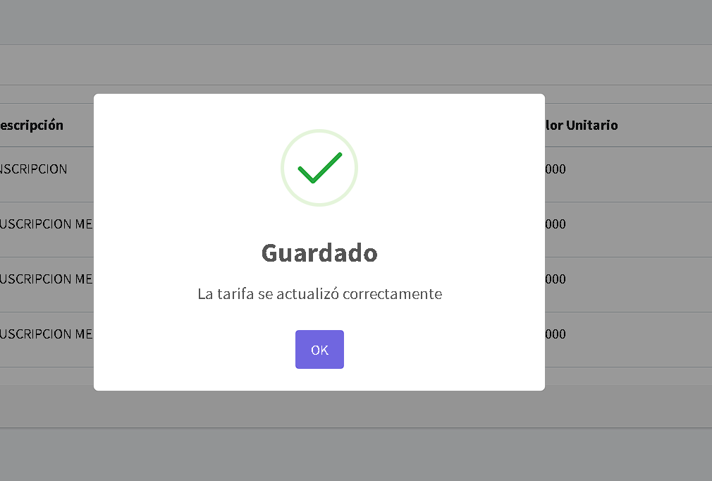

# Tarifas

## Instrucciones para Generar Tarifas.

En el módulo de tarifa podemos encontrar el valor de las tarifas y la modificación de estas.

1.
Ingresa al módulo de Tarifas, dando clic en el botón **“Tarifas”**.

2.
Se visualiza el listado de tarifas.

En este listado podemos observar el valor de las diferentes tarifas que maneja el sistema y la modificación de estas.

3.
Para poder modificar las tarifas, debemos ubicar el cursor en el botón de **“Editar”**.

4.
Se muestra una nueva ventana, donde podemos modificar el valor de la tarifa indicada.

5.
Para guardar los cambios, damos clic en el botón **“Guardar Cambios”**.

6.
Nos notifica una alerta preguntando si estamos seguros de actualizar las tarifas, junto con una advertencia que dice:  
   **“Esto afectará el precio de las próximas facturas emitidas.”**  
   Dependiendo de tu opción, puedes dar clic en **“Actualizar tarifa”** o **“Cancelar”**. 
   
   Si seleccionamos cancelar, nos devolverá al punto anterior.

   

7.
Si seleccionamos **“Actualizar tarifa”**, se muestra una notificación de **“Guardado”** con el mensaje de que la tarifa se actualizó correctamente.

