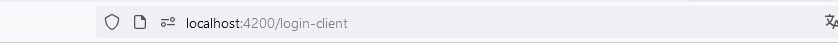
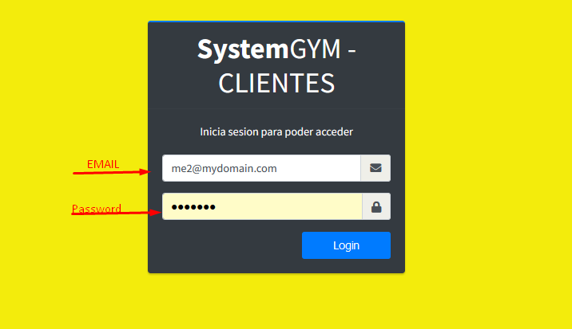

# Login

## Instrucciones para Ingresar LOGIN

1.
**Ingreso**: En su navegador de preferencia, ingrese la dirección URL, para fines demostrativos, se utilizará la URL `localhost:4200/login-client`. Esta lo dirigirá a la página principal de ingreso al sistema.

2.
**Iniciar sesión**: Para ingresar al sistema deberá ser un usuario con el rol de **Cliente**. Cuando te inscribes al gimnasio podras acceder al sistema utilizando el correo utilizado en la inscripcion y la contreña por default es "cliente". Con la credencial de correo y contraseña, puede ingresar al sistema. Introduzca el correo en el campo **Email** y la contraseña en el campo **Password**, y luego haga clic en el botón **Sign in**.

## Si las credenciales son correctas nos rediriga al dashboard que se vera algo como esto

