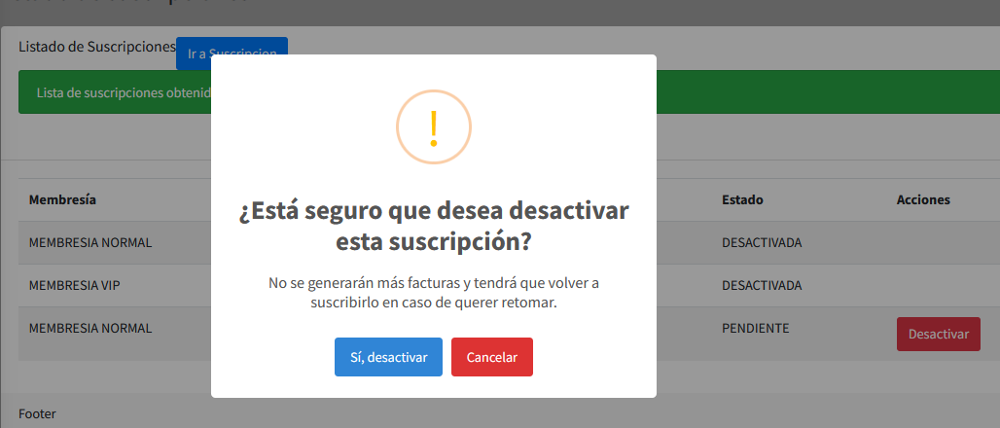
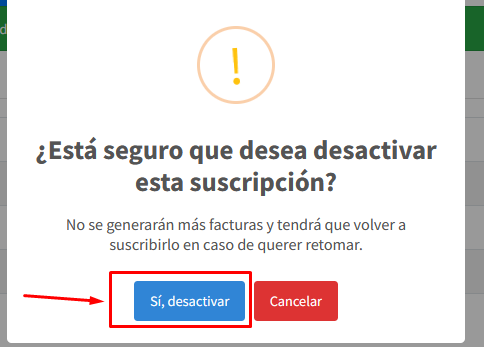
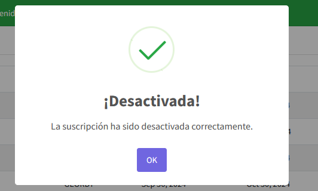

## Suscripcion Desactivar

Para desactivar una suscripcion porque un cliente se quiere dar de baja de una suscripcion y necesitas desactivarla para evitar que se sigan generando facturas, entonces, deberas dirigirte a la lista de Suscripciones, un menu como este

En esta tabla, podras ver todas las suscripciones en el sistema y las que estan activas/pendientes/vigentes actualmente, en la columna de Acciones te aparecera un boton que dice "Desactivar" este boton te permitira desactivar la suscripcion,
simplemente debes darle click y te aparecera un mensaje como este

Si estas seguro de desactivar la suscripcion entonces simplemente, da click en  "Si, desactivar"

Si la operacion de desactivar la suscripcion se ejecuta correctamente, entonces te saldra un mensaje como este

