## Instrucciones para Generar Egresos

1.
Acceder al módulo de Egresos, haz clic en el botón "Egresos".

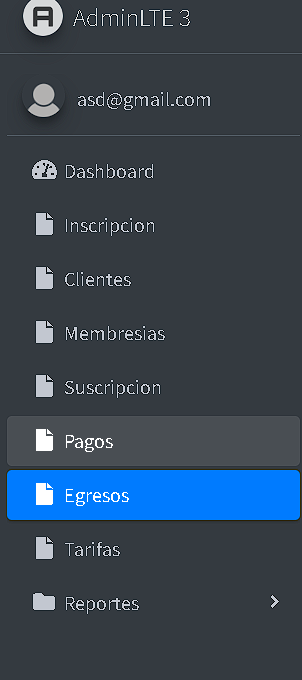

2.
Visualización de egresos, Este módulo te permite ver el listado de egresos existentes y crear nuevos egresos.

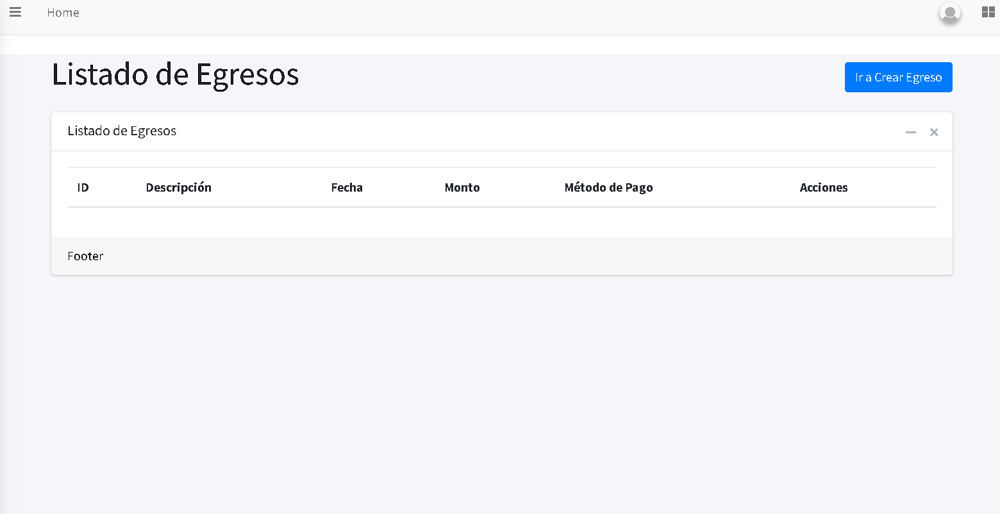

## **Crear un nuevo egreso**

3.
 Haz clic en el botón **"Ir a Crear Egreso"**.

 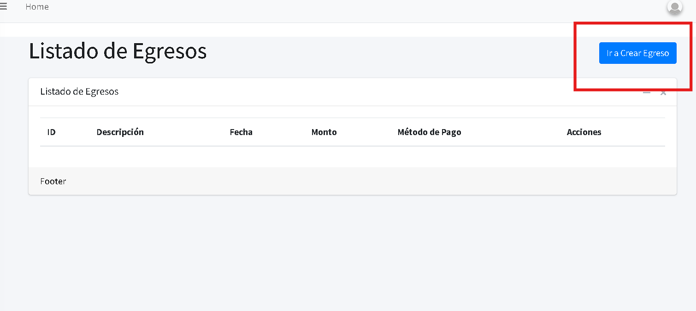
 
4.
 Se abrirá un formulario donde podrás registrar el egreso. Completa los siguientes campos con la información solicitada:

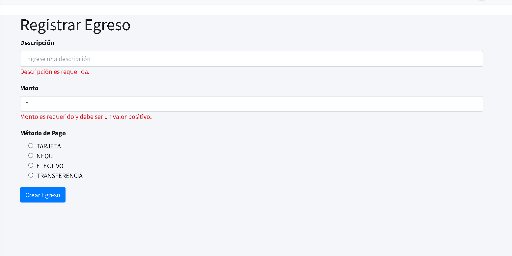

   - **Descripción**: Escribe la descripción del producto o servicio a pagar.

   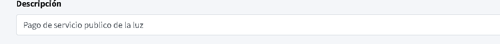

   - **Monto**: Ingresa el valor correspondiente al pago.
   
   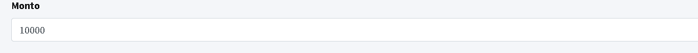

   - **Método de pago**: Selecciona el método de pago, como Tarjeta, Nequi, Efectivo o Transferencia.

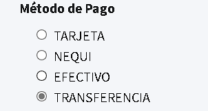 

5.
Para finalizar, haz clic en el botón **"Crear Egreso"**.

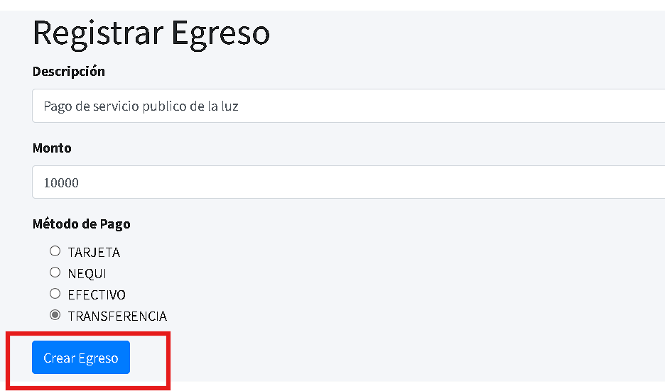

6.
El sistema te notificará que el egreso ha sido registrado con éxito.

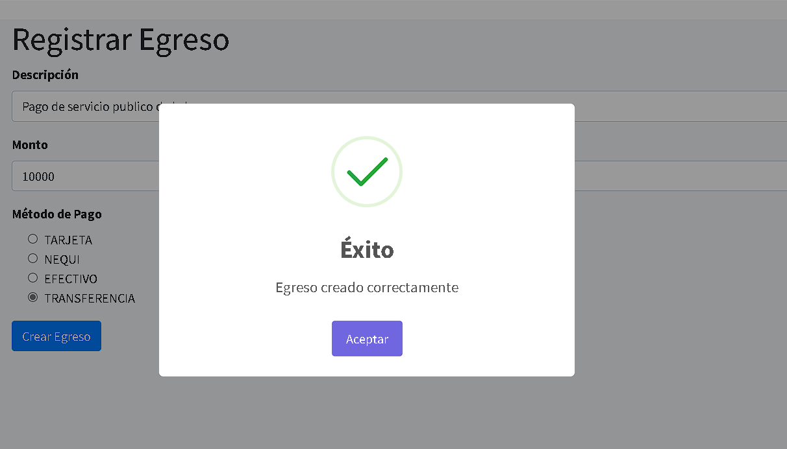

7.
Después de registrarse exitosamente el egreso, el sistema nos redirige al listado de egresos, donde podremos visualizar todos los egresos realizados.

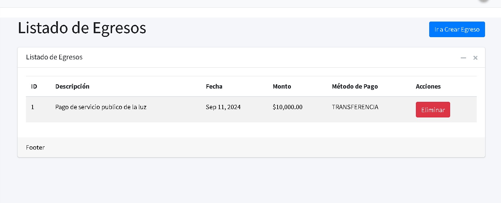

8.
Si es necesario eliminar un egreso, haz clic en el botón **"Eliminar"**.

9.
Aparecerá una notificación con el mensaje: **"¿Está seguro?"**, junto con la observación **"El egreso será eliminado. Si el egreso es de otro día, no se podrá eliminar".** Si seleccionas **"Cancelar"**, serás redirigido nuevamente al listado de egresos.

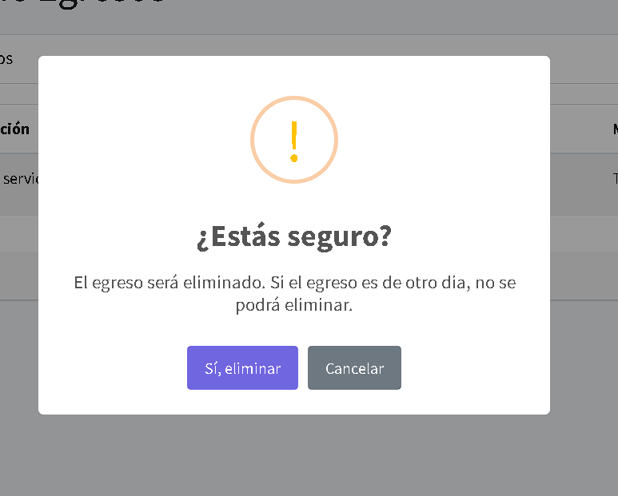

10.
Al hacer clic en **"Sí, eliminar"**, el sistema mostrará una notificación confirmando que el egreso ha sido eliminado.

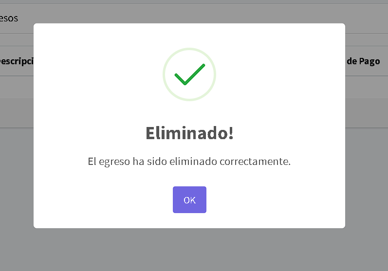
