# Pagos

## Instrucciones para Generar Pagos.

En este módulo, puedes consultar el listado de pagos y realizar nuevos pagos para los clientes.

1.
Ingresar al módulo de Pagos Haz clic en el botón **“Pagos”**.

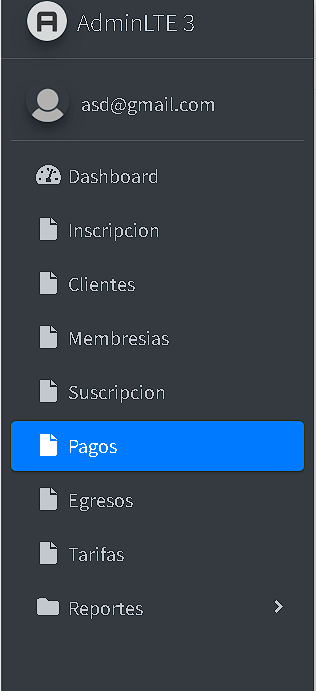

2.
Se mostrará un listado de pagos. Si no aparecen pagos, es porque aún no se han realizado.

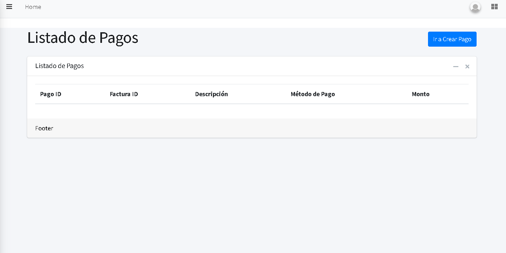

## **Crear Pagos**

3.
Dirígete a la parte superior derecha y haz clic en el botón que dice **“Ir a Crear Pagos”**.

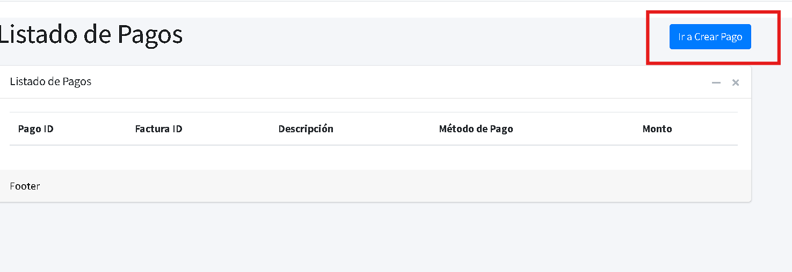

4.
Esto te llevará a un formulario donde podrás completar los detalles del pago.

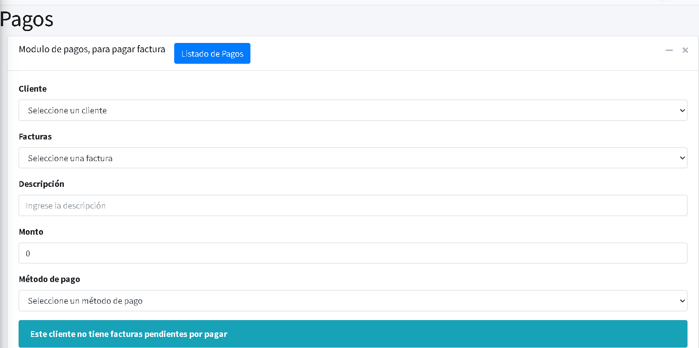

5.
En el formulario, encontrarás el botón **“Lista de Pagos”**. Al hacer clic, regresarás a la página anterior, donde podrás visualizar los pagos realizados.

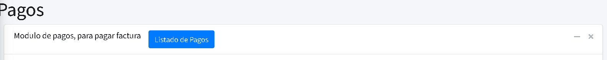

## **Completa las casillas con la información solicitada**:

   - **Cliente**: Selecciona al cliente que solicita el pago. Se desplegará un listado de clientes; elige el adecuado.

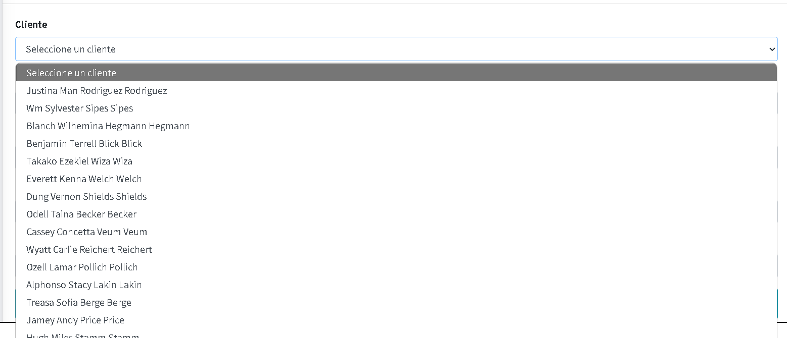

   - **Facturas**: Dependiendo del cliente seleccionado, se mostrarán las facturas pendientes de pago.

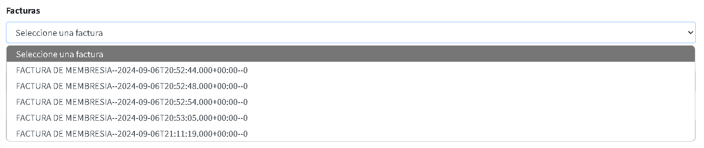

   - **Descripción**: Añade cualquier tipo de observación en la descripción.

   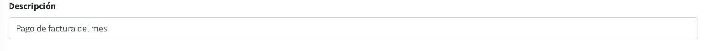
   
   - **Monto**: El monto corresponde al valor que el cliente adeuda y se asigna automáticamente según el cliente seleccionado.

   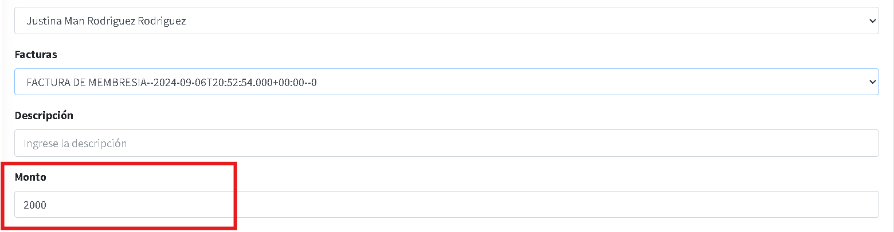

   - **Método de pago**: Ingresa el método de pago preferido por el cliente, como Nequi, transferencia bancaria, efectivo o tarjeta.

   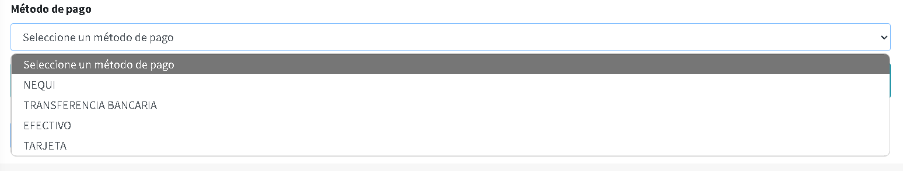

   **Al finalizar el ingreso de la información, aparece un mensaje que nos recuerda el monto pendiente por pagar.**

   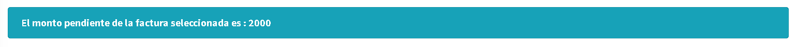

6.
Finalmente, para completar el pago, presiona el botón **“Confirmar Pago”**.

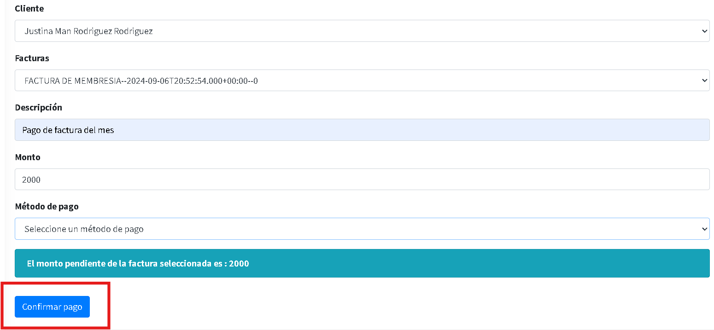

7.
Si omites algún dato, aparecerá un mensaje de **“ERROR”**indicando la casilla que falta por completar.

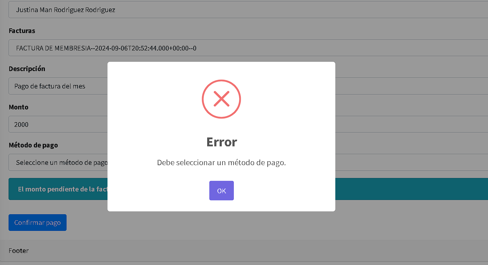

8.
Si toda la información se ha completado correctamente, aparecerá un mensaje de **“Pago Realizado”**. Finalmente, haz clic en **“OK”**.

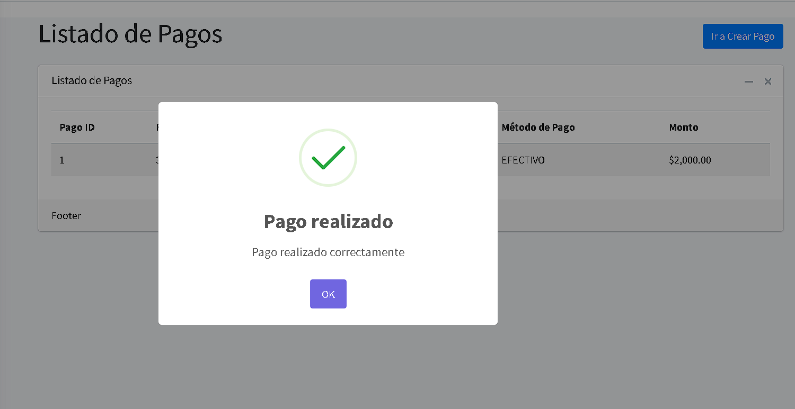

9.
Después, podrás visualizar el pago de la factura en el listado de pagos.

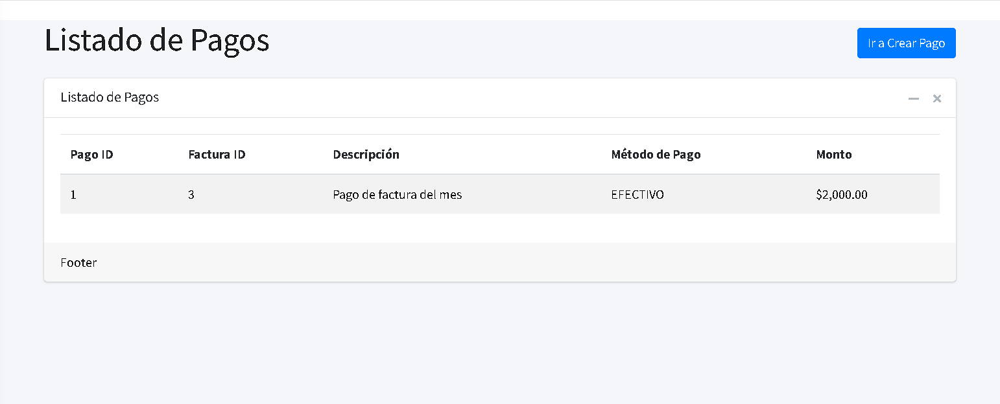
