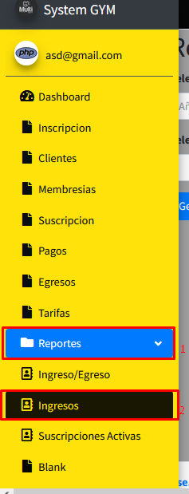
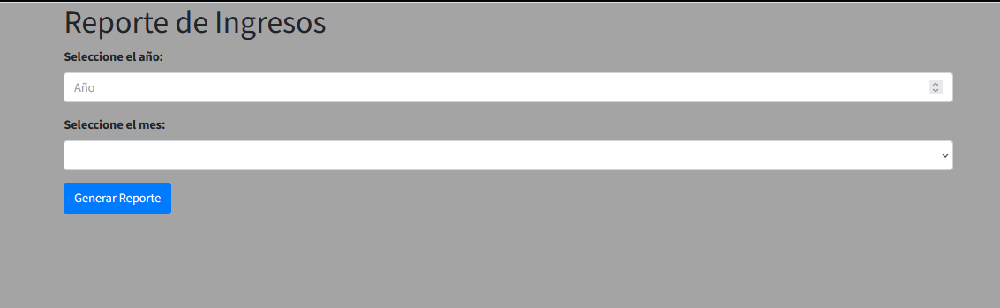
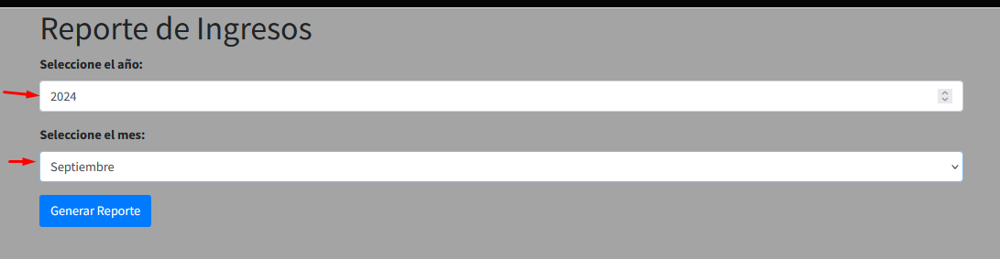
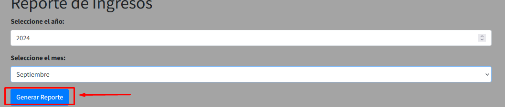
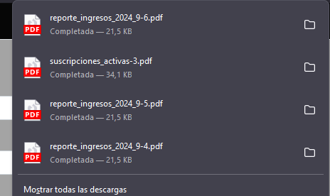
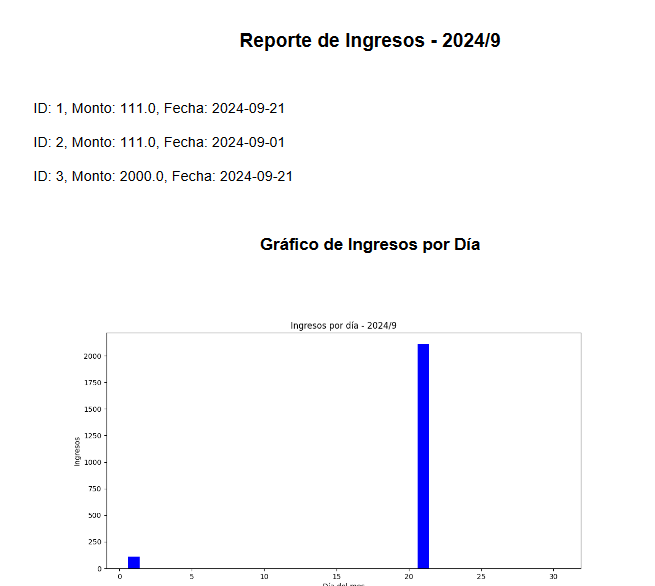

Para poder acceder al menu para generar el reporte de ingresos, deberas situarte en la barra de navegacion y buscar el apartado donde dice "Reportes" esto te desplegara un menu, dentro de ese menu aparecen varias opciones, en este caso elegiras la de "Ingresos" como en la imagen

Una vez le des click te aparecera un menu como este

Este menu cuenta con dos campos, en el primero deberas ingresar la fecha en un formato de 4 digitos, ejemplo "2024", 
en el segundo campo que es un selector, deberas seleccionar el mes del cual deseas generar el reporte

Una vez llenes esos dos campos, entonces deberas darle al boton que dice "Generar Reporte", espera unos segundos y se te descargara en el navegador un PDF que contendra el reporte basado en los criterios que pusiste

