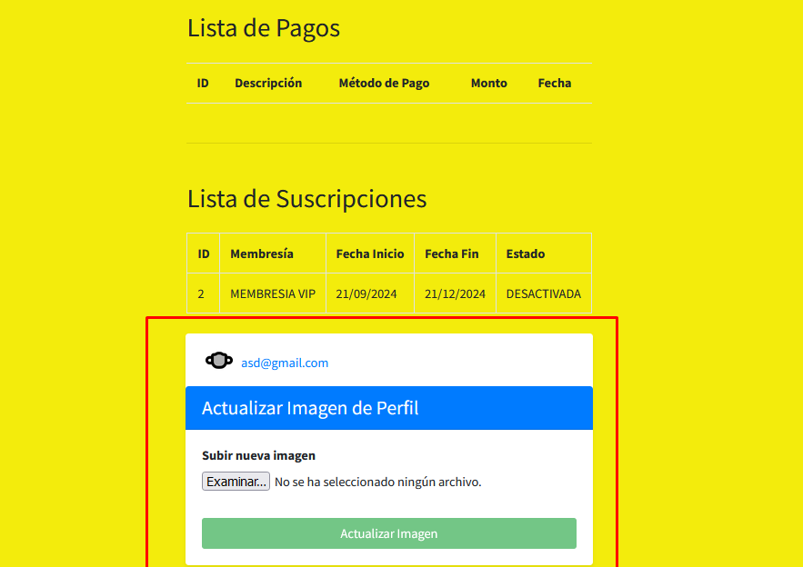
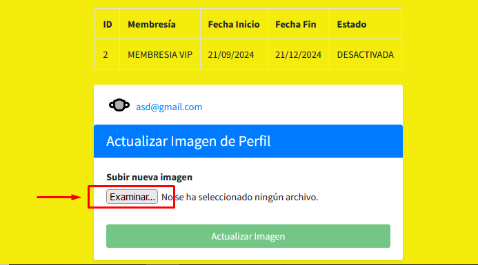
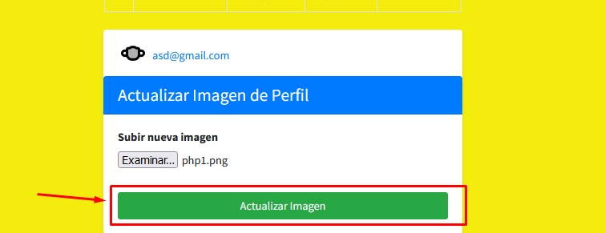

## Actualizar la imagen de perfil

Cuando estas en el dashboard, te aparecera una parte donde puedes actualizar la foto de perfil, un menu similar a este

Deberas darle click al boton de "Examinar", este boton te abrira el explorador de archivos de tu computador, luego escoges la imagen que quieres poner de perfil, de preferencia se admiten los formatos "jpg/png" usar un formato contrario a este podria provocar fallas en la calidad o visualizacion de la imagen

Una vez seleccionada la imagen le deberas dar click al boton que dice "Actualizar imagen"

Si todo sale bien en la actualizacion de la imagen deberas ver un mensaje de exito como este

Para poder ver la nueva imagen, deberas cerrar la sesion y volver a entrar, para ver la nueva imagen